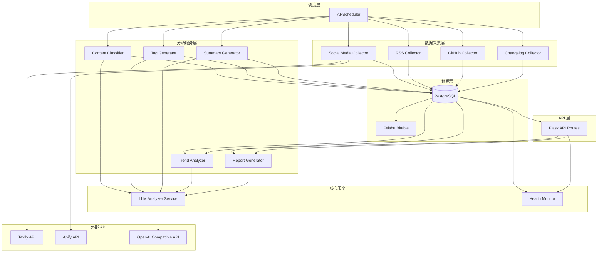

# 技术设计文档：分析和洞察自动化

## Overview

本设计文档定义了 InsightRadar 系统的分析和洞察自动化功能的技术实现方案。该功能扩展了现有的竞品数据采集系统，增加了社交媒体数据源、LLM 驱动的智能分析、趋势识别和自动化报告生成能力。

核心目标：
- 扩展数据采集能力，支持社交媒体数据源（Tavily、Apify）
- 构建 LLM 分析层，实现内容自动分类、标签生成和摘要提取
- 提供趋势分析和竞品对比能力
- 实现定时任务调度和数据源健康监控
- 保持系统模块化、可扩展和高性能（API 响应 < 500ms）

技术栈：
- 后端框架：Flask
- 数据库：PostgreSQL（生产）/ SQLite（开发）
- 外部服务：Tavily API、Apify API、OpenAI 兼容 API
- 任务调度：APScheduler
- 数据同步：飞书多维表格 API

## Architecture

### 系统架构图



### 架构设计原则

1. **分层架构**：采集层、分析层、服务层、API 层清晰分离
2. **模块化设计**：每个分析服务独立封装，可单独测试和替换
3. **统一 LLM 接口**：所有 LLM 调用通过 LLMAnalyzer 服务统一管理
4. **异步处理**：采集和分析任务通过调度器异步执行，不阻塞 API 响应
5. **容错设计**：外部 API 调用包含重试机制和降级策略
6. **性能优化**：批量处理、缓存策略、数据库索引优化

## Components and Interfaces

### 1. Social Media Collector (collectors/social.py)

社交媒体数据采集器，支持 Tavily 和 Apify 两种数据源。

```python
class SocialMediaCollector(BaseCollector):
    """
    社交媒体数据采集器
    
    支持两种模式：
    - fast: 使用 Tavily API 快速洞察
    - deep: 使用 Apify API 深度抓取
    """
    
    def __init__(self, product_name: str, keywords: List[str], mode: str = 'fast'):
        """
        Args:
            product_name: 产品名称
            keywords: 搜索关键词列表
            mode: 采集模式 ('fast' 或 'deep')
        """
        pass
    
    def collect(self) -> List[Dict]:
        """
        执行社交媒体数据采集
        
        Returns:
            标准化的更新记录列表
        """
        pass
    
    def _collect_from_tavily(self, keyword: str) -> List[Dict]:
        """使用 Tavily API 采集数据"""
        pass
    
    def _collect_from_apify(self, keyword: str) -> List[Dict]:
        """使用 Apify API 采集数据"""
        pass
```

**接口依赖**：
- Tavily API: `POST https://api.tavily.com/search`
- Apify API: `GET https://api.apify.com/v2/acts/{actor_id}/runs/{run_id}`

**配置参数**：
- `TAVILY_API_KEY`: Tavily API 密钥
- `APIFY_API_KEY`: Apify API 密钥
- `SOCIAL_KEYWORDS`: 搜索关键词（逗号分隔）
- `SOCIAL_COLLECTION_MODE`: 采集模式（fast/deep）

### 2. LLM Analyzer Service (services/llm_analyzer.py)

统一的 LLM 分析服务，封装所有与 OpenAI 兼容 API 的交互。

```python
class LLMAnalyzer:
    """
    LLM 分析服务
    
    提供统一的 LLM 调用接口，支持：
    - 内容分类
    - 标签生成
    - 摘要生成
    - 趋势分析
    """
    
    def __init__(self):
        """初始化 LLM 客户端"""
        pass
    
    def classify_content(self, title: str, content: str) -> str:
        """
        分类内容类型
        
        Args:
            title: 标题
            content: 内容
            
        Returns:
            分类结果 (feature/bug/ai/pricing/strategy)
        """
        pass
    
    def generate_tags(self, title: str, content: str, update_type: str) -> List[str]:
        """
        生成智能标签
        
        Args:
            title: 标题
            content: 内容
            update_type: 更新类型
            
        Returns:
            标签列表（最多 5 个）
        """
        pass
    
    def generate_summary(self, content: str, max_length: int = 200) -> str:
        """
        生成内容摘要
        
        Args:
            content: 原始内容
            max_length: 最大长度
            
        Returns:
            摘要文本
        """
        pass
    
    def analyze_trends(self, updates: List[Dict]) -> List[Dict]:
        """
        分析趋势和聚类
        
        Args:
            updates: 更新记录列表
            
        Returns:
            趋势组列表
        """
        pass
    
    def _call_llm(self, messages: List[Dict], temperature: float = 0.3) -> str:
        """
        调用 LLM API（内部方法）
        
        包含重试逻辑和错误处理
        """
        pass
```

**配置参数**：
- `OPENAI_API_BASE`: API 端点地址
- `OPENAI_API_KEY`: API 密钥
- `OPENAI_MODEL`: 模型名称（默认：gpt-3.5-turbo）
- `OPENAI_TIMEOUT`: 请求超时时间（默认：30 秒）
- `OPENAI_MAX_TOKENS`: 最大 token 数（默认：1000）

### 3. Content Classifier (services/classifier.py)

内容分类服务，将更新分类为不同类型。

```python
class ContentClassifier:
    """
    内容分类器
    
    使用 LLM 将内容分类为：
    - feature: 新功能
    - bug: 错误修复
    - ai: AI 相关
    - pricing: 定价变化
    - strategy: 战略调整
    """
    
    def __init__(self, llm_analyzer: LLMAnalyzer):
        self.llm_analyzer = llm_analyzer
    
    def classify_update(self, update: ProductUpdate) -> str:
        """
        分类单条更新
        
        Args:
            update: ProductUpdate 对象
            
        Returns:
            分类结果
        """
        pass
    
    def classify_batch(self, updates: List[ProductUpdate]) -> Dict[str, str]:
        """
        批量分类更新
        
        Args:
            updates: ProductUpdate 对象列表
            
        Returns:
            {update_id: classification} 字典
        """
        pass
```

### 4. Tag Generator (services/tagger.py)

标签生成服务，为内容生成智能标签。

```python
class TagGenerator:
    """
    标签生成器
    
    预定义标签：
    - A/B Testing
    - Funnel
    - Session Replay
    - AI Insights
    - Data Warehouse
    - Real-time Analytics
    - User Segmentation
    - Retention Analysis
    - Cohort Analysis
    - Product Analytics
    """
    
    PREDEFINED_TAGS = [
        "A/B Testing", "Funnel", "Session Replay", "AI Insights",
        "Data Warehouse", "Real-time Analytics", "User Segmentation",
        "Retention Analysis", "Cohort Analysis", "Product Analytics"
    ]
    
    def __init__(self, llm_analyzer: LLMAnalyzer):
        self.llm_analyzer = llm_analyzer
    
    def generate_tags(self, update: ProductUpdate) -> List[str]:
        """
        为单条更新生成标签
        
        Args:
            update: ProductUpdate 对象
            
        Returns:
            标签列表（最多 5 个）
        """
        pass
    
    def generate_tags_batch(self, updates: List[ProductUpdate]) -> Dict[str, List[str]]:
        """
        批量生成标签
        
        Args:
            updates: ProductUpdate 对象列表
            
        Returns:
            {update_id: tags} 字典
        """
        pass
```

### 5. Summary Generator (services/summarizer.py)

摘要生成服务，为长内容生成简洁摘要。

```python
class SummaryGenerator:
    """
    摘要生成器
    
    为长内容（>500 字符）生成摘要（≤200 字符）
    """
    
    def __init__(self, llm_analyzer: LLMAnalyzer):
        self.llm_analyzer = llm_analyzer
    
    def generate_summary(self, update: ProductUpdate) -> str:
        """
        为单条更新生成摘要
        
        Args:
            update: ProductUpdate 对象
            
        Returns:
            摘要文本
        """
        pass
    
    def generate_summaries_batch(self, updates: List[ProductUpdate]) -> Dict[str, str]:
        """
        批量生成摘要
        
        Args:
            updates: ProductUpdate 对象列表
            
        Returns:
            {update_id: summary} 字典
        """
        pass
```

### 6. Trend Analyzer (services/trend_analyzer.py)

趋势分析服务，识别相似内容和热点方向。

```python
class TrendAnalyzer:
    """
    趋势分析器
    
    分析过去 30 天的更新，识别：
    - 相似主题的内容组
    - 热点功能方向
    - 竞品战略重点
    """
    
    def __init__(self, llm_analyzer: LLMAnalyzer):
        self.llm_analyzer = llm_analyzer
    
    def analyze_trends(self, days: int = 30, min_updates: int = 5) -> List[Dict]:
        """
        分析趋势
        
        Args:
            days: 分析天数
            min_updates: 最小更新数量阈值
            
        Returns:
            趋势组列表，每个包含：
            - trend_title: 趋势标题
            - update_count: 更新数量
            - products: 涉及的产品列表
            - sample_updates: 示例更新
        """
        pass
    
    def get_trending_tags(self, days: int = 30) -> List[Dict]:
        """
        获取热门标签
        
        Returns:
            标签统计列表
        """
        pass
```

### 7. Report Generator (services/report_generator.py)

报告生成服务，生成周报和竞品对比。

```python
class ReportGenerator:
    """
    报告生成器
    
    生成：
    - 周报（过去 7 天）
    - 竞品能力对比矩阵
    """
    
    def __init__(self, llm_analyzer: LLMAnalyzer):
        self.llm_analyzer = llm_analyzer
    
    def generate_weekly_report(self) -> Dict:
        """
        生成周报
        
        Returns:
            周报数据，包含：
            - period: 时间范围
            - highlights: 重点更新
            - stats_by_product: 按产品统计
            - stats_by_type: 按类型统计
            - most_active_product: 最活跃产品
            - trending_categories: 热门类别
        """
        pass
    
    def generate_comparison_matrix(self) -> Dict:
        """
        生成竞品对比矩阵
        
        Returns:
            对比数据，包含：
            - matrix: {product: {tag: count}}
            - leaders: {tag: product}
            - summary: 总结文本
        """
        pass
```

### 8. Task Scheduler (scheduler.py)

定时任务调度器，管理自动化任务。

```python
class TaskScheduler:
    """
    任务调度器
    
    使用 APScheduler 管理定时任务：
    - 数据采集任务
    - LLM 分析任务
    - 健康检查任务
    """
    
    def __init__(self, app: Flask):
        self.app = app
        self.scheduler = BackgroundScheduler()
        self.task_history = []
    
    def start(self):
        """启动调度器"""
        pass
    
    def schedule_daily_collection(self, hour: int = 2, minute: int = 0):
        """
        配置每日采集任务
        
        Args:
            hour: 小时（0-23）
            minute: 分钟（0-59）
        """
        pass
    
    def schedule_analysis_pipeline(self):
        """配置分析流水线任务"""
        pass
    
    def trigger_collection_manually(self) -> Dict:
        """手动触发采集任务"""
        pass
    
    def _execute_collection_task(self):
        """执行采集任务（内部方法）"""
        pass
    
    def _execute_analysis_task(self):
        """执行分析任务（内部方法）"""
        pass
    
    def _record_task_execution(self, task_name: str, status: str, error: str = None):
        """记录任务执行历史"""
        pass
```

### 9. Health Monitor (services/health_monitor.py)

数据源健康监控服务。

```python
class HealthMonitor:
    """
    健康监控器
    
    监控数据源状态：
    - 最后成功采集时间
    - 连续失败次数
    - 异常告警
    """
    
    def __init__(self):
        self.source_status = {}
    
    def record_success(self, source_name: str):
        """记录采集成功"""
        pass
    
    def record_failure(self, source_name: str, error: str):
        """记录采集失败"""
        pass
    
    def get_source_health(self, source_name: str) -> Dict:
        """
        获取数据源健康状态
        
        Returns:
            {
                "source_name": str,
                "status": "healthy" | "warning" | "error",
                "last_success": datetime,
                "consecutive_failures": int,
                "last_error": str
            }
        """
        pass
    
    def get_all_sources_health(self) -> List[Dict]:
        """获取所有数据源健康状态"""
        pass
    
    def check_stale_sources(self, threshold_hours: int = 48) -> List[str]:
        """检查过期数据源"""
        pass
```

### 10. API Routes Extension (routes/api.py)

扩展 API 路由，添加洞察端点。

```python
# 新增路由

@api_bp.route('/reports/weekly', methods=['GET'])
def get_weekly_report():
    """获取周报"""
    pass

@api_bp.route('/trends', methods=['GET'])
def get_trends():
    """
    获取趋势分析
    
    Query Parameters:
        - days: 分析天数（默认 30）
    """
    pass

@api_bp.route('/compare', methods=['GET'])
def get_comparison():
    """获取竞品对比矩阵"""
    pass

@api_bp.route('/health/sources', methods=['GET'])
def get_sources_health():
    """获取数据源健康状态"""
    pass

@api_bp.route('/analyze/trigger', methods=['POST'])
def trigger_analysis():
    """手动触发分析流水线"""
    pass
```

## Data Models

### 扩展 ProductUpdate 模型

现有的 `ProductUpdate` 模型已经包含了所需的字段，无需修改：

```python
class ProductUpdate(db.Model):
    # 现有字段已满足需求
    id = db.Column(UUID(as_uuid=True), primary_key=True, default=uuid.uuid4)
    product = db.Column(db.String(100), nullable=False, index=True)
    source_type = db.Column(db.String(50), nullable=False)  # 支持 'social'
    title = db.Column(db.String(500), nullable=False)
    content = db.Column(db.Text, nullable=True)
    summary = db.Column(db.Text, nullable=True)  # LLM 生成的摘要
    update_type = db.Column(db.String(50), nullable=True, index=True)  # LLM 分类结果
    tags = db.Column(ARRAY(db.String), nullable=True)  # LLM 生成的标签
    engagement = db.Column(db.Integer, default=0)
    publish_time = db.Column(db.DateTime, nullable=False, index=True)
    source_url = db.Column(db.String(1000), unique=True, nullable=False)
    content_hash = db.Column(db.String(64), nullable=False, index=True)
    created_at = db.Column(db.DateTime, default=datetime.utcnow)
    raw_data = db.Column(JSONB, nullable=True)
```

### 新增 DataSourceHealth 模型

用于持久化数据源健康状态。

```python
class DataSourceHealth(db.Model):
    """数据源健康状态"""
    __tablename__ = 'data_source_health'
    
    id = db.Column(db.Integer, primary_key=True)
    source_name = db.Column(db.String(100), unique=True, nullable=False, index=True)
    source_type = db.Column(db.String(50), nullable=False)  # rss, github, social, changelog
    last_success_time = db.Column(db.DateTime, nullable=True)
    last_failure_time = db.Column(db.DateTime, nullable=True)
    consecutive_failures = db.Column(db.Integer, default=0)
    last_error = db.Column(db.Text, nullable=True)
    status = db.Column(db.String(20), default='unknown')  # healthy, warning, error, unknown
    updated_at = db.Column(db.DateTime, default=datetime.utcnow, onupdate=datetime.utcnow)
    
    def to_dict(self):
        return {
            "source_name": self.source_name,
            "source_type": self.source_type,
            "status": self.status,
            "last_success_time": self.last_success_time.isoformat() if self.last_success_time else None,
            "last_failure_time": self.last_failure_time.isoformat() if self.last_failure_time else None,
            "consecutive_failures": self.consecutive_failures,
            "last_error": self.last_error,
            "updated_at": self.updated_at.isoformat() if self.updated_at else None
        }
```

### 新增 TaskExecutionLog 模型

用于记录任务执行历史。

```python
class TaskExecutionLog(db.Model):
    """任务执行日志"""
    __tablename__ = 'task_execution_logs'
    
    id = db.Column(db.Integer, primary_key=True)
    task_name = db.Column(db.String(100), nullable=False, index=True)
    task_type = db.Column(db.String(50), nullable=False)  # collection, analysis, report
    status = db.Column(db.String(20), nullable=False)  # success, failure, running
    start_time = db.Column(db.DateTime, nullable=False, default=datetime.utcnow)
    end_time = db.Column(db.DateTime, nullable=True)
    duration_seconds = db.Column(db.Float, nullable=True)
    error_message = db.Column(db.Text, nullable=True)
    metadata = db.Column(JSONB, nullable=True)  # 任务相关元数据
    
    def to_dict(self):
        return {
            "id": self.id,
            "task_name": self.task_name,
            "task_type": self.task_type,
            "status": self.status,
            "start_time": self.start_time.isoformat() if self.start_time else None,
            "end_time": self.end_time.isoformat() if self.end_time else None,
            "duration_seconds": self.duration_seconds,
            "error_message": self.error_message,
            "metadata": self.metadata
        }
```

### 数据库索引优化

为支持高效查询，需要确保以下索引存在：

```python
# 在 models.py 中添加索引定义
Index('idx_product_publish_time', ProductUpdate.product, ProductUpdate.publish_time.desc())
Index('idx_update_type_publish_time', ProductUpdate.update_type, ProductUpdate.publish_time.desc())
Index('idx_tags_gin', ProductUpdate.tags, postgresql_using='gin')  # PostgreSQL GIN 索引用于数组查询
Index('idx_source_health_status', DataSourceHealth.status, DataSourceHealth.updated_at.desc())
Index('idx_task_log_name_time', TaskExecutionLog.task_name, TaskExecutionLog.start_time.desc())
```


## Error Handling

### 错误分类和处理策略

#### 1. 外部 API 错误

**Tavily/Apify API 错误**：
- **网络超时**：重试 3 次，指数退避（1s, 2s, 4s）
- **认证失败**：记录错误日志，跳过该数据源，发送告警
- **速率限制**：等待 60 秒后重试，最多重试 2 次
- **无效响应**：记录原始响应，跳过该条数据，继续处理其他数据

**OpenAI 兼容 API 错误**：
- **网络超时**：重试 2 次，间隔 1 分钟
- **Token 超限**：截断输入内容，重试一次
- **模型不可用**：使用降级策略（返回默认值或简化处理）
- **内容过滤**：记录日志，使用规则基础的备用方案

#### 2. 数据库错误

**连接错误**：
- 使用连接池自动重连
- 重试 3 次，间隔 5 秒
- 失败后记录错误并返回 503 状态码

**约束违反**：
- 唯一性冲突（content_hash, source_url）：跳过该记录，记录日志
- 外键约束：验证关联数据存在性，失败则回滚事务

**查询超时**：
- 设置查询超时为 10 秒
- 超时后返回部分结果或缓存数据
- 记录慢查询日志用于优化

#### 3. 任务调度错误

**任务执行失败**：
- 记录到 TaskExecutionLog 表
- 5 分钟后自动重试，最多 3 次
- 3 次失败后标记为最终失败，发送告警

**任务超时**：
- 采集任务超时：30 分钟
- 分析任务超时：15 分钟
- 超时后强制终止，记录日志

**并发冲突**：
- 使用分布式锁防止同一任务并发执行
- 检测到锁时跳过本次执行，记录日志

#### 4. 数据验证错误

**输入验证**：
- 必填字段缺失：返回 400 错误，明确指出缺失字段
- 格式错误：返回 400 错误，提供格式示例
- 范围错误：返回 400 错误，说明有效范围

**数据完整性**：
- 检测到异常数据（如未来时间戳）：记录警告，使用当前时间替代
- 内容为空：跳过该记录，记录日志

### 错误日志格式

所有错误日志使用统一格式：

```python
{
    "timestamp": "2024-01-15T10:30:00Z",
    "level": "ERROR",
    "component": "SocialMediaCollector",
    "error_type": "APITimeout",
    "message": "Tavily API request timeout after 3 retries",
    "context": {
        "product": "PostHog",
        "keyword": "product analytics",
        "retry_count": 3
    },
    "stack_trace": "..."
}
```

### 降级策略

当 LLM 服务不可用时，使用以下降级策略：

1. **内容分类**：使用关键词匹配规则
   - 包含 "AI", "GPT", "machine learning" → ai
   - 包含 "price", "pricing", "plan" → pricing
   - 包含 "bug", "fix", "issue" → bug
   - 默认 → feature

2. **标签生成**：使用关键词提取
   - 从标题和内容中提取预定义标签关键词
   - 返回匹配的标签列表

3. **摘要生成**：使用简单截断
   - 取内容前 200 字符
   - 在句子边界截断

### 监控和告警

**告警触发条件**：
- 数据源连续 3 次采集失败
- 数据源超过 48 小时未成功采集
- LLM API 错误率超过 20%
- 数据库连接池耗尽
- 任务队列积压超过 100 个

**告警方式**：
- 记录到系统日志（ERROR 级别）
- 写入 DataSourceHealth 表
- 可选：集成飞书机器人发送通知

## Testing Strategy

### 测试方法概述

本功能不适合 Property-Based Testing，因为：
- 主要涉及外部服务集成（Tavily、Apify、OpenAI API）
- 包含大量副作用操作（数据库写入、定时任务）
- 配置验证和基础设施设置

测试策略采用：
1. **单元测试**：测试纯函数逻辑和数据转换
2. **集成测试**：使用 Mock 测试外部 API 交互
3. **端到端测试**：测试完整的数据流水线
4. **性能测试**：验证 API 响应时间要求

### 单元测试

**测试框架**：pytest

**测试覆盖**：

1. **BaseCollector 数据标准化**
   - 测试 `standardize_update()` 方法
   - 验证字段映射正确性
   - 测试 `generate_content_hash()` 一致性

2. **LLMAnalyzer Prompt 构建**
   - 测试各类 prompt 模板生成
   - 验证参数替换正确性
   - 测试边界情况（空输入、超长输入）

3. **数据模型方法**
   - 测试 `to_dict()` 序列化
   - 验证日期时间格式化
   - 测试 NULL 值处理

4. **工具函数**
   - 测试关键词提取
   - 测试文本截断逻辑
   - 测试降级策略函数

**示例测试**：

```python
def test_generate_content_hash_consistency():
    """测试内容哈希生成的一致性"""
    collector = BaseCollector("TestProduct")
    content = "Test content"
    hash1 = collector.generate_content_hash(content)
    hash2 = collector.generate_content_hash(content)
    assert hash1 == hash2
    assert len(hash1) == 64  # SHA256 hex length

def test_standardize_update_format():
    """测试更新标准化格式"""
    collector = BaseCollector("TestProduct")
    result = collector.standardize_update(
        title="Test Title",
        content="Test Content",
        source_type="test",
        source_url="https://example.com",
        publish_time=datetime(2024, 1, 1)
    )
    assert result["product"] == "TestProduct"
    assert result["title"] == "Test Title"
    assert "content_hash" in result
    assert result["source_type"] == "test"
```

### 集成测试（使用 Mock）

**测试框架**：pytest + pytest-mock + responses

**测试覆盖**：

1. **Social Media Collector**
   - Mock Tavily API 响应
   - Mock Apify API 响应
   - 测试错误处理和重试逻辑
   - 测试数据去重

2. **LLM Analyzer Service**
   - Mock OpenAI API 响应
   - 测试超时和重试
   - 测试降级策略
   - 测试不同类型的分析任务

3. **分析服务（Classifier, Tagger, Summarizer）**
   - Mock LLMAnalyzer 返回值
   - 测试批量处理
   - 测试数据库更新

4. **Report Generator**
   - Mock 数据库查询结果
   - 测试报告生成逻辑
   - 测试空数据处理

**示例测试**：

```python
@pytest.fixture
def mock_tavily_response():
    return {
        "results": [
            {
                "title": "PostHog launches new feature",
                "content": "PostHog announced...",
                "url": "https://example.com/post1",
                "published_date": "2024-01-15T10:00:00Z"
            }
        ]
    }

def test_social_collector_tavily_success(mock_tavily_response, responses):
    """测试 Tavily API 成功采集"""
    responses.add(
        responses.POST,
        "https://api.tavily.com/search",
        json=mock_tavily_response,
        status=200
    )
    
    collector = SocialMediaCollector("PostHog", ["product analytics"], mode="fast")
    results = collector.collect()
    
    assert len(results) == 1
    assert results[0]["source_type"] == "social"
    assert results[0]["product"] == "PostHog"

def test_social_collector_tavily_retry(responses):
    """测试 Tavily API 重试机制"""
    responses.add(
        responses.POST,
        "https://api.tavily.com/search",
        json={"error": "timeout"},
        status=504
    )
    responses.add(
        responses.POST,
        "https://api.tavily.com/search",
        json={"results": []},
        status=200
    )
    
    collector = SocialMediaCollector("PostHog", ["test"], mode="fast")
    results = collector.collect()
    
    assert len(responses.calls) == 2  # 验证重试发生
```

### 端到端测试

**测试环境**：使用测试数据库（SQLite 或 PostgreSQL）

**测试场景**：

1. **完整采集流水线**
   - 触发采集任务
   - 验证数据写入数据库
   - 验证飞书同步
   - 验证 LLM 分析执行

2. **周报生成流程**
   - 准备测试数据（过去 7 天的更新）
   - 调用周报 API
   - 验证报告结构和内容

3. **趋势分析流程**
   - 准备测试数据（过去 30 天的更新）
   - 调用趋势 API
   - 验证聚类结果

4. **健康监控流程**
   - 模拟数据源失败
   - 验证健康状态更新
   - 验证告警触发

### 性能测试

**测试工具**：pytest-benchmark 或 locust

**性能要求验证**：

1. **API 响应时间**
   - GET /api/reports/weekly < 500ms
   - GET /api/trends < 500ms
   - GET /api/compare < 500ms
   - GET /api/health/sources < 100ms

2. **分类性能**
   - 单条记录分类 < 200ms（需求 2.6）
   - 批量分类（100 条）< 10s

3. **数据库查询优化**
   - 使用 EXPLAIN ANALYZE 验证索引使用
   - 确保复杂查询使用索引扫描而非全表扫描

**示例性能测试**：

```python
def test_weekly_report_performance(client, benchmark):
    """测试周报 API 性能"""
    def call_weekly_report():
        return client.get('/api/reports/weekly')
    
    result = benchmark(call_weekly_report)
    assert result.status_code == 200
    # benchmark 会自动报告执行时间

@pytest.mark.parametrize("update_count", [10, 50, 100])
def test_classifier_batch_performance(update_count):
    """测试批量分类性能"""
    updates = [create_test_update() for _ in range(update_count)]
    
    start = time.time()
    classifier.classify_batch(updates)
    duration = time.time() - start
    
    # 100 条记录应在 10 秒内完成
    assert duration < 10.0
```

### 测试数据管理

**Fixtures**：

```python
@pytest.fixture
def test_db():
    """创建测试数据库"""
    app.config['SQLALCHEMY_DATABASE_URI'] = 'sqlite:///:memory:'
    with app.app_context():
        db.create_all()
        yield db
        db.session.remove()
        db.drop_all()

@pytest.fixture
def sample_updates():
    """创建示例更新数据"""
    return [
        {
            "product": "PostHog",
            "title": "New AI feature",
            "content": "PostHog launches AI insights...",
            "source_type": "blog",
            "source_url": "https://example.com/1",
            "publish_time": datetime.utcnow()
        },
        # ... 更多示例
    ]

@pytest.fixture
def mock_llm_analyzer(mocker):
    """Mock LLM Analyzer"""
    mock = mocker.Mock(spec=LLMAnalyzer)
    mock.classify_content.return_value = "feature"
    mock.generate_tags.return_value = ["AI Insights", "Product Analytics"]
    mock.generate_summary.return_value = "Summary text"
    return mock
```

### 测试覆盖率目标

- 整体代码覆盖率：≥ 80%
- 核心业务逻辑：≥ 90%
- 错误处理路径：≥ 70%

### CI/CD 集成

**测试执行流程**：

1. **Pre-commit**：运行 linter（flake8, black）
2. **Pull Request**：
   - 运行所有单元测试
   - 运行集成测试（使用 Mock）
   - 生成覆盖率报告
3. **Merge to main**：
   - 运行完整测试套件
   - 运行性能测试
   - 部署到测试环境

**测试命令**：

```bash
# 运行所有测试
pytest tests/ -v

# 运行特定类型的测试
pytest tests/unit/ -v
pytest tests/integration/ -v
pytest tests/e2e/ -v

# 生成覆盖率报告
pytest tests/ --cov=. --cov-report=html

# 运行性能测试
pytest tests/performance/ -v --benchmark-only
```

### 测试环境配置

**环境变量**（.env.test）：

```bash
DATABASE_URL=sqlite:///:memory:
TAVILY_API_KEY=test_key
APIFY_API_KEY=test_key
OPENAI_API_BASE=http://localhost:8000/v1
OPENAI_API_KEY=test_key
OPENAI_MODEL=gpt-3.5-turbo
FEISHU_APP_ID=test_app_id
FEISHU_APP_SECRET=test_secret
```

**Mock 服务**：
- 可选：使用 WireMock 或 VCR.py 录制和回放 HTTP 交互
- 可选：使用 LocalStack 模拟 AWS 服务（如需要）

